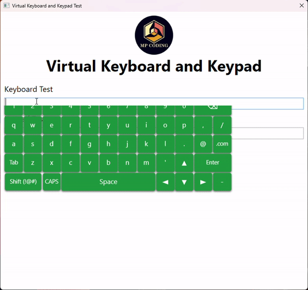

WPF Virtual Keyboard and Keypad
================================



## Usage
- Include Namespace
```xml
<Window ...
        xmlns:mpvk="http://schemas.mpcoding.com/mpcoding/wpf/virtualkeys">
```
- Add Keyboard.
```xml

<TextBox
    mpvk:VirtualKeyboard.KeyboardWidth="600"
    mpvk:VirtualKeyboard.Mode="TouchAndMouse" />
```
- Add Keypad.
```xml
<TextBox
    mpvk:VirtualKeyPad.KeyPadWidth="300"
    mpvk:VirtualKeyPad.Mode="TouchAndMouse" />
```

* Modes
    1. Disabled
    2. Touch
    3. Mouse
    4. TouchAndMouse